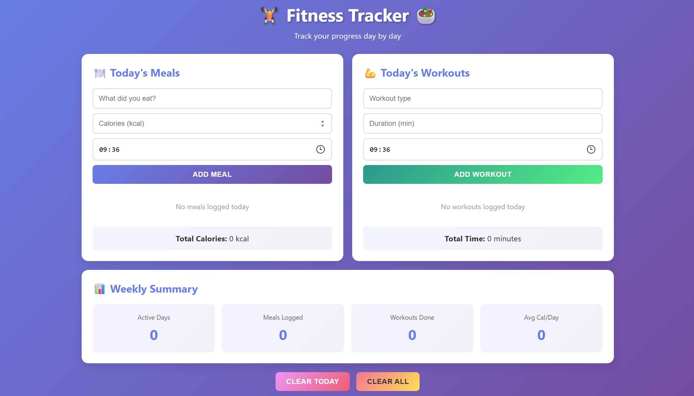

# 🏋️ Fitness & Nutrition Tracker 🥗

A simple web application to track your daily meals and workouts. Built with vanilla HTML, CSS, and JavaScript - no frameworks, no backend, no data collection.

**🤖 AI-Powered Development**: This project was created as a test using GitHub Copilot to explore AI-assisted coding.

## ✨ Features

- **📝 Meal Tracking**: Log your meals with calories and time
- **💪 Workout Logging**: Record your workouts with duration
- **📊 Weekly Statistics**: View your progress over the last 7 days
- **💾 Local Storage**: All data saved in your browser
- **📱 Responsive Design**: Works on desktop, tablet, and mobile
- **⚡ Fast & Lightweight**: Pure vanilla JavaScript, no dependencies

## Preview

